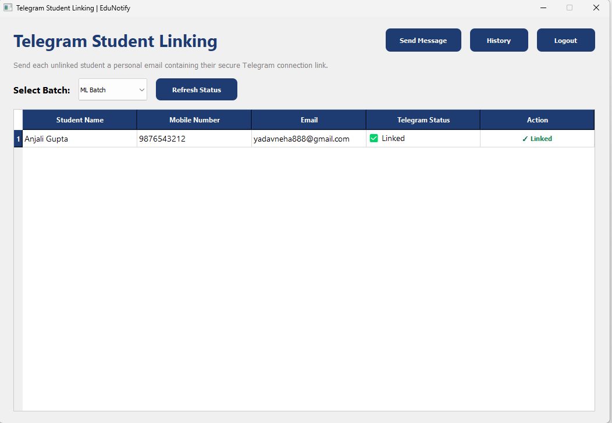
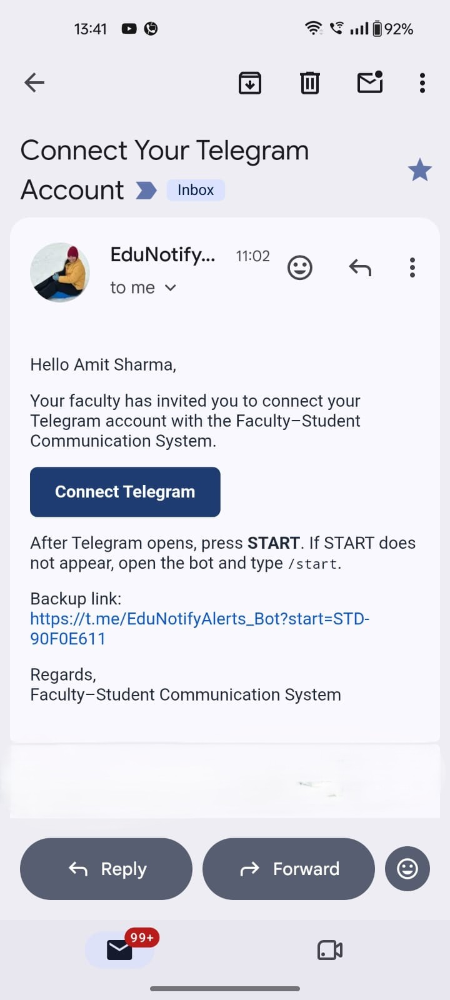
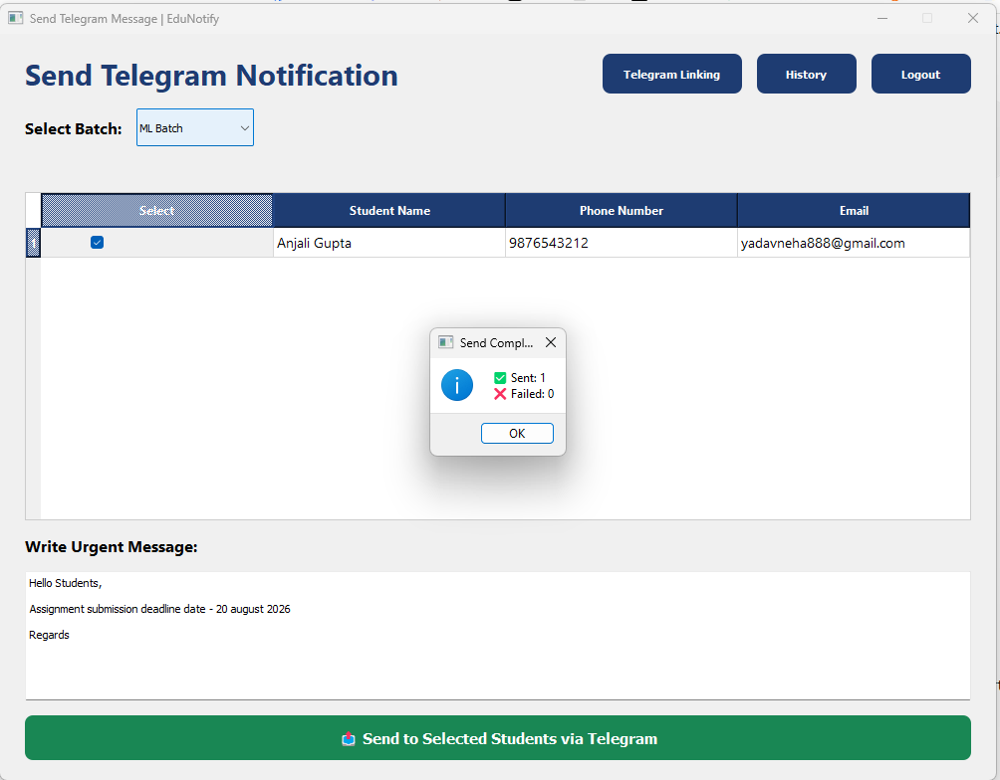
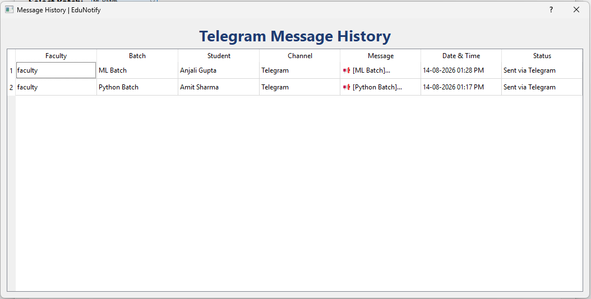

# EduNotify – Telegram Alert System

EduNotify is a desktop-based **Telegram Alert System** for faculty-to-student notifications, built with **Python, PyQt5, SQLite, SMTP, and the Telegram Bot API**.

The system allows faculty members to view students batch-wise, send secure Telegram linking invitations through email, communicate only with successfully linked students through Telegram, and maintain a complete history of sent notifications.

---

## ✨ Key Features

- Faculty login through a PyQt5 desktop interface
- Batch-wise student records
- Email-based Telegram onboarding
- Secure student-specific Telegram deep links
- Unique `STD-...` Telegram linking codes
- Automatic Telegram `chat_id` registration
- Linked / Not Linked student status tracking
- Refreshable Telegram Linking Dashboard
- Linked-only recipient filtering
- Batch-wise Telegram notifications
- Multiple-student selection
- Message delivery success/failure feedback
- Persistent message history
- SQLite database storage
- Environment-based secret management using `.env`

---

## 🏗️ System Architecture

```text
                         ┌───────────────────────┐
                         │      FACULTY USER     │
                         └───────────┬───────────┘
                                     │
                                     ▼
                         ┌───────────────────────┐
                         │     Faculty Login     │
                         │      PyQt5 GUI        │
                         └───────────┬───────────┘
                                     │
                                     ▼
                    ┌────────────────────────────────┐
                    │  Telegram Linking Dashboard    │
                    │      Batch-wise Students       │
                    └───────────────┬────────────────┘
                                    │
                          Send Telegram Link
                                    │
                                    ▼
                         ┌───────────────────────┐
                         │      Gmail SMTP       │
                         │      Email Sender     │
                         └───────────┬───────────┘
                                     │
                                     ▼
                         ┌───────────────────────┐
                         │      Student Email    │
                         │   Connect Telegram    │
                         └───────────┬───────────┘
                                     │
                                     ▼
                         ┌───────────────────────┐
                         │     Telegram Bot      │
                         │    /start STD-CODE    │
                         └───────────┬───────────┘
                                     │
                                     ▼
                         ┌───────────────────────┐
                         │     Bot Listener      │
                         │  Validate Link Code   │
                         └───────────┬───────────┘
                                     │
                                     ▼
                         ┌───────────────────────┐
                         │    SQLite Database    │
                         │ Save Telegram chat_id │
                         │ Student = Linked      │
                         └───────────┬───────────┘
                                     │
                                     ▼
                    ┌────────────────────────────────┐
                    │      Send Message Dashboard    │
                    │      Linked Students Only      │
                    └───────────────┬────────────────┘
                                    │
                                    ▼
                         ┌───────────────────────┐
                         │   Telegram Bot API    │
                         └───────────┬───────────┘
                                     │
                                     ▼
                         ┌───────────────────────┐
                         │   Student Telegram    │
                         │ Notification Received │
                         └───────────┬───────────┘
                                     │
                                     ▼
                         ┌───────────────────────┐
                         │    Message History    │
                         │    SQLite Database    │
                         └───────────────────────┘
```

---

## 🔄 Application Workflow

```text
Faculty Login
      ↓
Telegram Linking Dashboard
      ↓
Select Batch
      ↓
View Students
      ↓
Send Telegram Link via Email
      ↓
Student Receives Email
      ↓
Student Clicks "Connect Telegram"
      ↓
Telegram Bot Opens
      ↓
Student Presses START
      ↓
Bot Receives /start + Secure Linking Code
      ↓
Telegram chat_id Saved
      ↓
Student Status = Linked
      ↓
Send Message GUI
      ↓
Only Linked Students Displayed
      ↓
Faculty Sends Telegram Notification
      ↓
Student Receives Message
      ↓
Message Saved in History
```

---

## 🖥️ Application Modules

### 1. Faculty Login

Faculty users authenticate before accessing the communication system.

### 2. Telegram Linking Dashboard

The dashboard displays students according to the selected batch.

For each student, faculty can view:

- Student name
- Mobile number
- Email address
- Telegram linking status
- Send / Resend Telegram Link action

Students who complete Telegram linking are displayed as **Linked**.

### 3. Email-Based Telegram Linking

For an unlinked student, faculty can click **Send Telegram Link**.

The system:

1. Retrieves the student's registered email.
2. Retrieves the student's secure Telegram linking code.
3. Generates a Telegram deep link.
4. Sends the link to the student through SMTP email.
5. Waits for the student to complete Telegram linking.

The deep link follows this format:

```text
https://t.me/YOUR_BOT_USERNAME?start=STD-XXXXXXXX
```

When the student opens the link and presses **START**, Telegram sends the embedded linking code to the bot. The application validates the code and stores the student's Telegram `chat_id`.

### 4. Linked Students Message GUI

The message screen displays **only students who have successfully linked their Telegram accounts**.

Faculty can:

- Select a batch
- Select one or more linked students
- Write a notification
- Send the notification through Telegram
- View sent/failed delivery counts

### 5. Message History

Sent notifications are stored in the system's history.

The history includes:

- Faculty
- Batch
- Student
- Channel
- Message
- Date & Time
- Status

---

## 🖥️ Application Demo

### Telegram Student Linking


### Email Invitation


### Send Telegram Alert


### Message History


### 📄 Complete Demo
[Download the Complete EduNotify System Demo (PDF)](docs/edunotify_system_demo.pdf)

---

## 🧰 Technology Stack

| Component | Technology |
|---|---|
| Programming Language | Python |
| Desktop GUI | PyQt5 |
| Database | SQLite |
| Telegram Integration | Telegram Bot API |
| Email Delivery | SMTP / Gmail |
| HTTP Communication | Requests |
| Environment Configuration | python-dotenv |

---

## 📁 Project Structure

```text
edunotify-telegram-alert-system/
│
├── FTS_codes/
│   ├── FTS_login.py
│   │   └── Application entry point and faculty login GUI
│   ├── FTS_linking_dashboard.py
│   │   └── Batch-wise student Telegram linking dashboard
│   ├── FTS_dashboard.py
│   │   └── Linked-student message sending GUI and message history
│   ├── FTS_database.py
│   │   └── SQLite schema, student records, linking state and message history
│   ├── FTS_email_sender.py
│   │   └── SMTP email delivery for Telegram linking invitations
│   ├── FTS_bot_listener.py
│   │   └── Telegram long-polling listener and /start processing
│   ├── FTS_telegram_api.py
│   │   └── Telegram Bot API calls, deep links, getUpdates and sendMessage
│   ├── FTS_telegram_sender.py
│   │   └── Telegram student-notification sending wrapper
│   ├── FTS_telegram_channel.py
│   │   └── Backward-compatible Telegram sender helper
│   └── FTS_config.py
│       └── Loads configuration from the repository-root .env file
│
├── docs/
│   ├── images/
│   │   ├── telegram-linking.png
│   │   ├── email-invitation.png
│   │   ├── send-alert.png
│   │   └── message-history.png
│   └── edunotify_system_demo.pdf
│       └── Complete end-to-end application demonstration
│
├── .env.example
│   └── Safe environment-variable template
├── .gitignore
│   └── Excludes secrets, local databases, environments and cache files
├── requirements.txt
│   └── Required Python packages
└── README.md
    └── Project documentation
```

> The real `edunotify.db` file is intentionally excluded from the public repository because it can contain student contact details, Telegram identifiers and message history.

---

## ⚙️ Installation

### 1. Clone or download the repository

```bash
git clone https://github.com/YOUR_USERNAME/edunotify-telegram-alert-system.git
cd edunotify-telegram-alert-system
```

You may also download the project as a ZIP file from GitHub.

### 2. Create a virtual environment

```bash
python -m venv .venv
```

### 3. Activate the environment

**Windows**

```bash
.venv\Scripts\activate
```

### 4. Install dependencies

```bash
pip install -r requirements.txt
```

---

## 🔐 Environment Configuration

Copy `.env.example` to `.env` and enter your own credentials.

```env
TELEGRAM_BOT_TOKEN=your_telegram_bot_token
TELEGRAM_BOT_USERNAME=your_bot_username

SMTP_HOST=smtp.gmail.com
SMTP_PORT=587
SMTP_USERNAME=your_email@gmail.com
SMTP_PASSWORD=your_google_app_password
SMTP_FROM_EMAIL=your_email@gmail.com
SMTP_FROM_NAME=EduNotify Faculty Communication
```

> **Never upload your real `.env` file, Telegram bot token, Gmail credentials, or Google App Password to GitHub.**

---

## 🤖 Telegram Bot Setup

1. Open Telegram.
2. Search for **@BotFather**.
3. Create a bot using `/newbot`.
4. Copy the generated bot token.
5. Add it to `.env` as `TELEGRAM_BOT_TOKEN`.
6. Add the bot username to `.env` as `TELEGRAM_BOT_USERNAME`.

The Telegram listener starts with the application and processes student linking requests.

---

## 📧 Gmail SMTP Setup

For Gmail SMTP:

1. Enable **2-Step Verification** on the Google account.
2. Create a **Google App Password**.
3. Add the App Password to `.env` as `SMTP_PASSWORD`.
4. Do not use the normal Gmail password.

Default Gmail SMTP settings:

```env
SMTP_HOST=smtp.gmail.com
SMTP_PORT=587
```

---

## ▶️ Running the Application

Create your private `.env` file in the **repository root** (next to `README.md`) using `.env.example` as the template.

Then start the system from the source-code folder:

```bash
cd FTS_codes
python FTS_login.py
```

`FTS_config.py` automatically loads the `.env` file from the repository root.

Normal application flow:

```text
Login
→ Telegram Linking Dashboard
→ Send Telegram Link
→ Student Links Telegram
→ Refresh Status
→ Send Message
→ Message History
```

---

## 🔒 Security

- Telegram bot tokens are loaded from environment variables.
- SMTP credentials are loaded from environment variables.
- `.env` is excluded from the public repository.
- Local SQLite databases are excluded from the public repository.
- Student Telegram links contain only an opaque `STD-...` linking code.
- Email addresses, phone numbers, and database IDs are not embedded in Telegram deep links.
- Telegram `chat_id` values are stored only after successful linking.
- Unlinked students are excluded from the Telegram message recipient list.
- Public sample data uses demo names, emails and phone numbers rather than real student information.

---

## 🚀 Future Improvements

Potential future extensions include:

- Admin and faculty role management
- Strong password hashing and authentication
- Student import from Excel/CSV
- Scheduled Telegram notifications
- Reusable notification templates
- Search and filtering in message history
- Export history to CSV/PDF
- Cloud deployment of the Telegram listener
- Web-based version of EduNotify

---

## 📌 Project Purpose

EduNotify demonstrates an end-to-end faculty communication workflow that avoids dependency on WhatsApp Business API access.

Students are onboarded securely through:

```text
Email → Telegram Link → Telegram Bot
```

After linking, faculty members can send batch-wise Telegram notifications and maintain a record of communication history.

---

## 👩‍💻 Author

**Neha Yadav**
